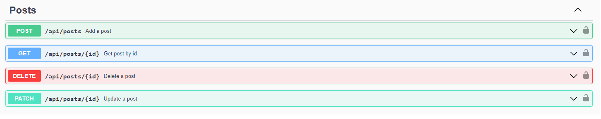
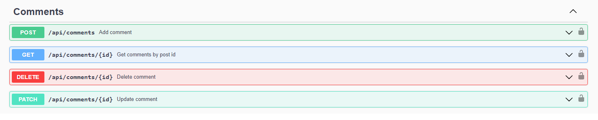
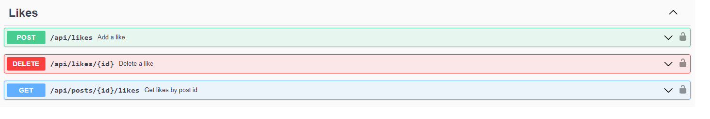
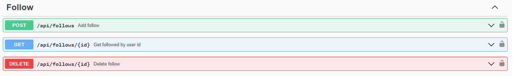

# Projekt realizowany w ramach przedmiotu "Język GO"
## Temat: Implementacja prostego portalu społecznościowego w języku Go

## Opis
Celem projektu jest implementacja prostego portalu społecznościowego w języku Go. Portal powinien umożliwiać:
- rejestrację użytkowników,
- logowanie użytkowników,
- autoryzacja użytkowników za pomocą Bearer Token,
- dodawanie, edycję, usuwanie i pobieranie postów,
- dodawanie, edycję, usuwanie i pobieranie komentarzy,
- dodawanie, edycję, usuwanie i pobieranie polubień,
- dodawanie, usuwanie i pobieranie obserwacji,
- dodanie swagger'a,
- dokumentacja.


## Podział prac

> P - Paweł Korytowski 
> 
> M - Mikołaj Marchewa

- [P] rejestracja użytkowników,
- [P] logowanie użytkowników,
- [P] autoryzacja użytkowników za pomocą Bearer Token,
- [M] dodawanie, edycję, usuwanie i pobieranie postów,
- [M] dodawanie, edycję, usuwanie i pobieranie komentarzy,
- [P] dodawanie, edycję, usuwanie i pobieranie polubień,
- [M] dodawanie, usuwanie i pobieranie obserwacji,
- [P] doadanie swagger'a,
- [M] dokumentacja,


## Logowanie/Rejestracja
Zaloguj się:
```
email: email@email.com
password: password
```

Zarejestruj się:
```
email: user@user.com
password: password
```

## Autoryzacja
Przy logowaniu oraz rejestracji użytkownik otrzymuje token, który jest potrzebny do autoryzacji. Funkcjonalność realizowana jest za pomocą middleware.
W nagłówku kolejnych zapytań należy podać token w formacie:
```
Baerer <token>
```

## Posty
Użytkonicy mogą dodawać posty, edytować, usuwać oraz pobierać posty.

Posty zapisywane są w formacie:
```
{
    "id": 1,
    "author_id": 1
    "content": "Post content",
    "created_at": "2021-01-01T00:00:00Z",
    "updated_at": "2021-01-01T00:00:00Z"
}
```
Wypróbuj w swaggerze:


## Komentarze
Użytkonicy mogą dodawać komentarze, edytować, usuwać oraz pobierać komentarze.

Komentarze zapisywane są w formacie:
```
{
    "id": 1,
    "author_id": 1,
    "content": "Comment content",
    "created_at": "2021-01-01T00:00:00Z",
    "updated_at": "2021-01-01T00:00:00Z",
    "parent_comment_id": 1,
    "post_id": 1
}
```

Wypróbuj w swaggerze:


## Polubienia
Użytkonicy mogą dodawać polubienia, usuwać oraz pobierać polubienia.

Polubienia zapisywane są w formacie:
```
{
    "id": 1,
    "user_id": 1,
    "post_id": 1,
}
```

Wypróbuj w swaggerze:


## Obserwacje
Użytkonicy mogą dodawać obserwacje, usuwać oraz pobierać obserwacje.

Obserwacje zapisywane są w formacie:
```
{
    "id": 1,
    "follows_id": 1,
    "followed_id": 1,
}
```

Wypróbuj w swaggerze:



## Stos technologiczny
Serwer napisano z wykorzystaniem następujących technologii:
- język Go
- biblioteki: gin, swagger, jwt-go, gorm

Baza danych:
- PostgreSQL
